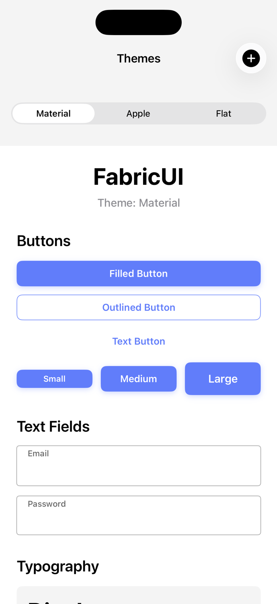
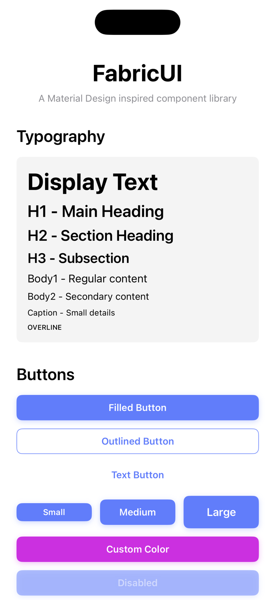
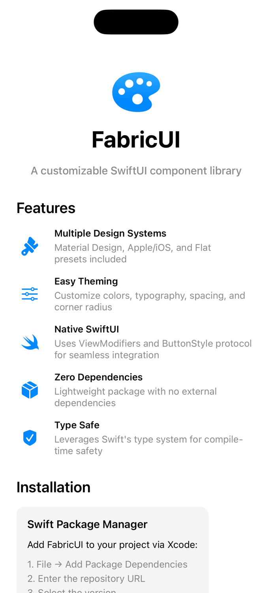

# DesignLab

A showcase app for the **FabricUI** design system library.

## Screenshots

<div align="center">
  
  
  
</div>

### Themes Tab
Live theme switching between Material, Apple, and Flat design systems, plus custom theme builder.

### Components Tab
Full gallery showcasing all FabricUI components with different styles and sizes.

### About Tab
Documentation, installation guide, and quick start examples.

## Project Structure

- `DesignLab/` - iOS app that demonstrates FabricUI components
- `FabricUI/` - Swift Package containing the FabricUI library

## Adding FabricUI to the Xcode Project

1. Open `DesignLab.xcodeproj` in Xcode
2. In the Project Navigator, select the DesignLab project (top item)
3. Select the DesignLab target
4. Go to the "General" tab
5. Scroll down to "Frameworks, Libraries, and Embedded Content"
6. Click the "+" button
7. Click "Add Package Dependency..."
8. Click "Add Local..."
9. Navigate to and select the `FabricUI` folder
10. Click "Add Package"

Alternatively, you can:
- File → Add Package Dependencies → Add Local → Select `FabricUI` folder

## Quick Start

Once the package is linked, import FabricUI in your SwiftUI views:

```swift
import FabricUI

// Apply a theme to your app
ContentView()
    .fabricTheme(.material)  // or .apple, .flat, or .custom(...)

// Use native SwiftUI components with FabricUI modifiers
Text("Hello World")
    .fabricTextStyle(.h1)

Button("Click Me") { }
    .buttonStyle(.fabricFilled())

TextField("", text: $email)
    .fabricTextFieldStyle("Email")
```

For detailed documentation, see `FabricUI/README.md`
